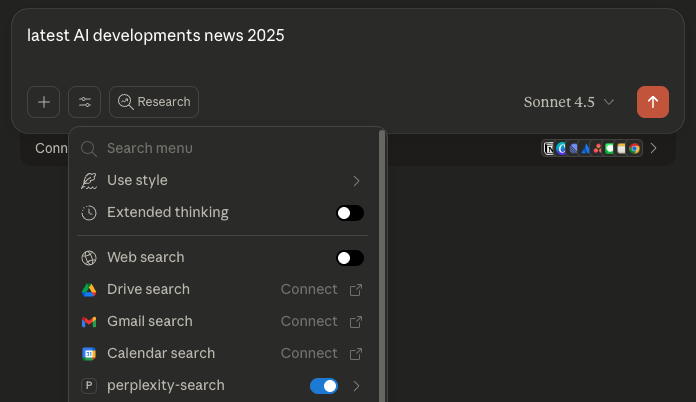
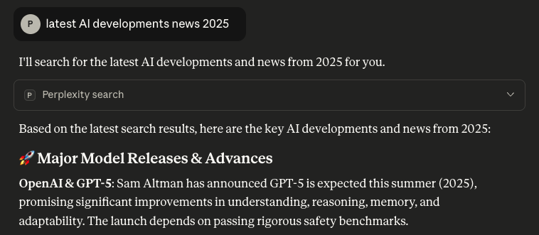

# Perplexity Search MCP Server

An MCP server implementation that integrates the Perplexity Search API to provide Claude with real-time web search capabilities.

> **Note:** This project was forked from [perplexityai/modelcontextprotocol](https://github.com/perplexityai/modelcontextprotocol) and has been modified to use only the Perplexity Search API.

## Quick Start Demo

Once configured, Claude can perform real-time web searches directly within your conversations:

```
You: "What are the latest AI developments in 2025?"
Claude: [Uses perplexity-search tool]
Claude: "Based on recent search results, here are the latest developments..."
```

### Visual Guide

**1. Enable the Tool**

Click the Research button and ensure "perplexity-search" is toggled on:



**2. Grant Permission**

When Claude wants to search, you'll see a permission dialog showing the query:


**3. Get Results**

Claude receives real-time search results with citations:



## Overview

This MCP (Model Context Protocol) server provides a tool for performing web searches using Perplexity's Search API. It leverages Perplexity's real-time web search technology to return ranked search results with titles, URLs, snippets, publication dates, and last updated timestamps.

The Search API powers products with unparalleled real-time, web-wide research capabilities, making it ideal for applications that need current information and comprehensive web coverage.

## Why This MCP Server?

**Give Claude Real-Time Knowledge**: Claude's training data has a cutoff date, but with this MCP server, Claude gains access to current information from across the web through Perplexity's Search API.

**Key Benefits:**
- 🎯 **Accurate & Current**: Get real-time information instead of relying on potentially outdated training data
- 🔗 **Source Citations**: Every result includes URLs and publication dates for verification
- 🌐 **Comprehensive Coverage**: Search across the entire web, not just a limited knowledge base
- ⚡ **Fast & Efficient**: Optimized search with configurable result limits and token extraction
- 🛠️ **Developer-Friendly**: Simple setup with TypeScript support and clear documentation

**Perfect For:**
- Research and fact-checking current events
- Finding recent documentation and technical resources
- Discovering trending topics and emerging technologies
- Answering questions that require up-to-date information
- Building AI applications that need web search capabilities

## Tech Stack

This project is built with modern, well-documented technologies. Each component includes links to official documentation for deeper learning and troubleshooting.

### Core Technologies

- **[TypeScript](https://www.typescriptlang.org/docs/)**: Type-safe server implementation with strict typing
  - [TypeScript Handbook](https://www.typescriptlang.org/docs/handbook/intro.html) - Comprehensive language guide
  - [Latest Release Notes](https://devblogs.microsoft.com/typescript/) - Stay updated with new features

- **[Model Context Protocol (MCP)](https://modelcontextprotocol.io/docs/sdk)**: Official SDK for building MCP servers
  - [MCP Specification](https://github.com/modelcontextprotocol/modelcontextprotocol) - Protocol specification and schema
  - [TypeScript SDK](https://github.com/modelcontextprotocol/typescript-sdk) - Official TypeScript implementation
  - [MCP Documentation](https://modelcontextprotocol.io) - Complete guides and tutorials

- **[Perplexity Search API](https://docs.perplexity.ai)**: Real-time web search with advanced filtering
  - [Search API Guide](https://docs.perplexity.ai/guides/search-guide) - Complete implementation guide
  - [API Reference](https://docs.perplexity.ai/api-reference/search-post) - Detailed endpoint documentation
  - [API Pricing](https://www.perplexity.ai/settings/api) - Current rates and limits

### Runtime & Package Management

- **[Node.js v18+](https://nodejs.org/download/release/v18.18.2/)**: JavaScript runtime environment
  - [Node.js Documentation](https://docs.npmjs.com/downloading-and-installing-node-js-and-npm/) - Installation and setup
  - [Node.js v18 Release Notes](https://nodejs.org/en/blog/announcements/v18-release-announce) - New features and improvements

- **[pnpm](https://pnpm.io)**: Fast, disk-efficient package manager
  - [pnpm Installation](https://pnpm.io/installation) - Setup guide for all platforms
  - [pnpm Documentation](https://pnpm.io/motivation) - Why pnpm and how it works
  - [GitHub Repository](https://github.com/pnpm/pnpm) - Source code and issue tracking

### Development & Deployment

- **[Express.js](https://expressjs.com)**: Web application framework for HTTP server mode
  - [Express.js Guide](https://expressjs.com/en/guide/routing.html) - Routing and middleware
  - [Express.js API Reference](https://expressjs.com/en/4x/api.html) - Complete API documentation
  - [Express.js Tutorial](https://developer.mozilla.org/en-US/docs/Learn_web_development/Extensions/Server-side/Express_Nodejs/Introduction) - MDN learning guide

- **[Docker](https://docs.docker.com)**: Containerization for deployment
  - [Docker Get Started](https://www.docker.com/get-started/) - Installation and basic usage
  - [Docker Documentation](https://docs.docker.com) - Complete reference and guides

- **[Fly.io](https://fly.io/docs/launch/deploy/)**: Cloud deployment platform
  - [Fly.io Deploy Guide](https://fly.io/docs/launch/deploy/) - Application deployment
  - [Fly.io CLI Reference](https://fly.io/docs/flyctl/deploy/) - Command-line tools

### Integration

- **[Claude Desktop](https://www.anthropic.com/engineering/desktop-extensions)**: MCP client integration
  - [Claude MCP Setup Guide](https://generect.com/blog/claude-mcp/) - Complete integration tutorial
  - [MCP Server Configuration](https://www.getmesa.com/blog/how-to-connect-mcp-server-claude/) - Advanced setup patterns

> **Quick Reference**: For troubleshooting and advanced configuration, see our [DEPLOYMENT.md](perplexity-search/DEPLOYMENT.md) which includes platform-specific deployment guides and troubleshooting steps.

## Future Compatibility

### MCP November 2025 Release Ready ✅

This project is **fully compatible** with the upcoming Model Context Protocol release on **November 25, 2025**. Our architecture choices align perfectly with the protocol's evolution.

#### **Release Timeline**
- **Release Candidate**: November 11, 2025
- **Final Release**: November 25, 2025
- **Validation Window**: 14-day RC testing period

#### **Current Configuration Benefits**
- ✅ **Transport Layer**: Uses Streamable HTTP (the future standard)
- ✅ **SDK Compatibility**: Built with official TypeScript SDK for seamless upgrades
- ✅ **Structured Responses**: Already implements structured tool outputs
- ✅ **Security Ready**: Basic auth can be enhanced with upcoming OAuth 2.1 features

#### **Upgrade Path**
The November 2025 release will be a **simple, non-breaking upgrade**:

1. **Update SDK**: `npm install @modelcontextprotocol/sdk@latest` (after November 25)
2. **Optional Enhancements**: Add new features like elicitation for user interactions
3. **Backward Compatibility**: Your existing configuration will continue working unchanged

#### **New Features Available**
- **Enhanced Security**: Optional OAuth 2.1 improvements for enterprise deployments
- **Elicitation**: Server-initiated user interactions for search refinement
- **Resource Links**: Enhanced integration between tools and data sources
- **Structured Tool Output**: Formalized schemas (already implemented in our responses)

#### **Documentation & Resources**
- [MCP November 2025 Roadmap](http://blog.modelcontextprotocol.io/posts/2025-09-26-mcp-next-version-update/) - Official release timeline and features
- [MCP Protocol Updates](https://modelcontextprotocol.io/specification/2025-03-26/changelog) - Technical changelog
- [MCP Future Roadmap](https://modelcontextprotocol.io/development/roadmap) - Long-term protocol direction

> **Stay Updated**: Monitor the [MCP GitHub repository](https://github.com/modelcontextprotocol/modelcontextprotocol) for release candidate announcements and detailed migration guides.

## Features

- 🔍 **Real-time Web Search**: Access up-to-date information from across the web using Perplexity's Search API
- 📊 **Structured Results**: Returns formatted search results with titles, URLs, snippets, and timestamps
- 🌍 **Regional Filtering**: Support for country-specific search results using ISO 3166-1 alpha-2 codes
- 🔢 **Flexible Result Limits**: Configure result counts (1-20 results per query)
- 🎯 **Multi-Query Support**: Process up to 5 search queries in a single request
- ⚡ **Batch Operations**: Efficient parallel processing for multiple searches
- 🔒 **Type-Safe Implementation**: Full TypeScript support for reliability and developer experience

## Tools

### perplexity-search

Performs web search using the Perplexity Search API and returns ranked search results.

**Inputs:**
- `query` (string | string[]): Search query string or array of query strings (max 5 queries)
- `max_results` (number, optional): Maximum number of results to return (1-20, default: 10)
- `max_tokens_per_page` (number, optional): Maximum tokens to extract per webpage (default: 1024)
- `country` (string, optional): ISO 3166-1 alpha-2 country code for regional results (e.g., 'US', 'GB')

**Output:**
Formatted search results including:
- Title
- URL
- Snippet
- Publication date
- Last updated timestamp

## Installation

### Prerequisites

- Node.js >= 18
- pnpm
- Perplexity API key

### Step 1: Clone and Install

```bash
git clone https://github.com/agenisea/perplexity-search-mcp.git
cd perplexity-search-mcp/perplexity-search
pnpm install
```

### Step 2: Get a Perplexity API Key

1. Sign up for a [Perplexity API account](https://www.perplexity.ai/settings/api)
2. Generate your API key from the developer dashboard
3. Create a `.env.local` file in the `perplexity-search` directory:

```bash
cp .env.local.example .env.local
```

4. Add your API key to `.env.local`:

```
PERPLEXITY_API_KEY=your_api_key_here
```

#### API Pricing & Rate Limits

The Perplexity Search API operates on a pay-as-you-go model:

- **Pricing**: Based on API requests and token usage (check [Perplexity Pricing](https://www.perplexity.ai/settings/api) for current rates)
- **Free Tier**: New accounts may receive initial credits for testing
- **Rate Limits**: Varies by subscription tier (see your dashboard for specific limits)
- **Credits**: Monitor your usage and credits in the [Perplexity API Settings](https://www.perplexity.ai/settings/api)

> **Tip**: Use the `max_results` and `max_tokens_per_page` parameters to control costs and optimize performance based on your needs.

### Step 3: Build the Project

```bash
pnpm run build
```

## Usage

### Local Development

**Stdio MCP Server** (for direct MCP client connections):
```bash
pnpm run dev
```

**HTTP Server** (for HTTP-based MCP clients like Claude Code):
```bash
pnpm run dev:server
```

### Production

**Stdio MCP Server**:
```bash
pnpm run start
```

**HTTP Server**:
```bash
pnpm run start:server
```

Or with explicit environment variables:

```bash
# Stdio server
PERPLEXITY_API_KEY=your_api_key node dist/index.js

# HTTP server
PERPLEXITY_API_KEY=your_api_key node dist/server.js
```

### Testing

Test the search functionality with the included test script:

```bash
node test-search.js
```

## Claude Desktop Configuration

### Method 1: Stdio MCP Server (Local)

Add this to your `claude_desktop_config.json`:

```json
{
  "mcpServers": {
    "perplexity-search": {
      "command": "node",
      "args": [
        "/absolute/path/to/perplexity-search-mcp/perplexity-search/dist/index.js"
      ],
      "env": {
        "PERPLEXITY_API_KEY": "YOUR_API_KEY_HERE"
      }
    }
  }
}
```

### Method 2: HTTP MCP Server (Local or Remote)

For HTTP-based connections (useful for Claude Code or remote deployments):

```json
{
  "mcpServers": {
    "perplexity-search": {
      "url": "http://localhost:8080/mcp",
      "auth": {
        "type": "basic",
        "username": "your_username",
        "password": "your_password"
      }
    }
  }
}
```

Set these environment variables for the HTTP server:
```bash
PERPLEXITY_API_KEY=your_api_key_here
MCP_USER=your_username
MCP_PASS=your_password
```

### Method 3: Remote Deployment

The project is pre-configured for Fly.io deployment but can be adapted for other cloud platforms.

#### Fly.io Deployment (Default Configuration)

The project includes `fly.toml` and `Dockerfile` configured for **private internal deployment**. The server is not exposed to the public internet and uses internal networking for security.

**Quick Start:**
```bash
# Deploy to Fly.io (private internal configuration)
fly deploy

# Set environment variables
fly secrets set PERPLEXITY_API_KEY=your_api_key_here
fly secrets set MCP_USER=your_username
fly secrets set MCP_PASS=your_password
```

**Security Note**: The default configuration uses Fly.io's internal network (`*.internal`) for private access only. No public ports are exposed, making it suitable for secure MCP client connections.

📖 **For complete deployment instructions, API documentation, and troubleshooting, see [DEPLOYMENT.md](perplexity-search/DEPLOYMENT.md)**

Then configure Claude to use your deployed server:
```json
{
  "mcpServers": {
    "perplexity-search": {
      "url": "https://your-app.fly.dev/mcp",
      "auth": {
        "type": "basic",
        "username": "your_username",
        "password": "your_password"
      }
    }
  }
}
```

#### AWS Deployment (Alternative)

To deploy to AWS with similar private network security, modify the configuration:

**AWS ECS/Fargate:**
1. Build and push Docker image to ECR:
```bash
# Build for AWS
docker build -t perplexity-search-mcp .
docker tag perplexity-search-mcp:latest your-account.dkr.ecr.region.amazonaws.com/perplexity-search-mcp:latest
docker push your-account.dkr.ecr.region.amazonaws.com/perplexity-search-mcp:latest
```

2. Create ECS task definition with environment variables and private networking:
```json
{
  "environment": [
    {"name": "PERPLEXITY_API_KEY", "value": "your_api_key"},
    {"name": "MCP_USER", "value": "your_username"},
    {"name": "MCP_PASS", "value": "your_password"},
    {"name": "PORT", "value": "8080"}
  ],
  "networkMode": "awsvpc"
}
```

**Note**: Deploy in private subnets with security groups allowing only necessary MCP client access.

**AWS Lambda (with serverless framework):**
1. Install serverless framework and create `serverless.yml`:
```yaml
service: perplexity-search-mcp
provider:
  name: aws
  runtime: nodejs18.x
  environment:
    PERPLEXITY_API_KEY: ${env:PERPLEXITY_API_KEY}
    MCP_USER: ${env:MCP_USER}
    MCP_PASS: ${env:MCP_PASS}
functions:
  app:
    handler: dist/lambda.handler
    events:
      - http:
          path: /{proxy+}
          method: ANY
```

2. Create Lambda handler wrapper (`lambda.ts`):
```typescript
import serverlessExpress from '@vendia/serverless-express';
import app from './server.js';
export const handler = serverlessExpress({ app });
```

#### Other Cloud Platforms

**Google Cloud Run (Private):**
```bash
gcloud run deploy perplexity-search-mcp \
  --image gcr.io/your-project/perplexity-search-mcp \
  --platform managed \
  --no-allow-unauthenticated \
  --ingress internal \
  --set-env-vars PERPLEXITY_API_KEY=your_key,MCP_USER=user,MCP_PASS=pass
```

**Azure Container Instances:**
```bash
az container create \
  --resource-group myResourceGroup \
  --name perplexity-search-mcp \
  --image your-registry/perplexity-search-mcp \
  --environment-variables PERPLEXITY_API_KEY=your_key MCP_USER=user MCP_PASS=pass
```

**Heroku:**
```bash
# Create Heroku app
heroku create your-app-name

# Set environment variables
heroku config:set PERPLEXITY_API_KEY=your_key MCP_USER=user MCP_PASS=pass

# Deploy
git push heroku main
```

### Using Docker

Build and run with Docker:

```bash
# Build the Docker image
docker build -t perplexity-search-mcp perplexity-search/

# Run the container (stdio mode)
docker run -i --rm -e PERPLEXITY_API_KEY=your_api_key_here perplexity-search-mcp

# Run the container (HTTP mode)
docker run -p 8080:8080 --rm \
  -e PERPLEXITY_API_KEY=your_api_key_here \
  -e MCP_USER=your_username \
  -e MCP_PASS=your_password \
  perplexity-search-mcp node dist/server.js
```

Access the config file:

```bash
# macOS
vim ~/Library/Application\ Support/Claude/claude_desktop_config.json

# Windows
notepad %APPDATA%\Claude\claude_desktop_config.json
```

## Verifying the Integration

1. Open Claude Desktop
2. Look for the hammer icon (🔨) in the interface
3. Click it to see available MCP tools
4. You should see `perplexity-search` listed

If the tool appears, the integration is active and Claude can now perform web searches via Perplexity!

## Advanced Configuration

You can customize search parameters directly in your tool calls:

```javascript
{
  "query": "artificial intelligence",
  "max_results": 5,
  "max_tokens_per_page": 2048,
  "country": "US"
}
```

For multi-query searches:

```javascript
{
  "query": ["AI trends 2024", "machine learning applications", "neural networks"],
  "max_results": 10
}
```

Refer to the official [Perplexity Search API documentation](https://docs.perplexity.ai/api-reference/search-post) for more details.

## About the Perplexity Search API

The [Perplexity Search API](https://www.perplexity.ai/hub/blog/introducing-the-perplexity-search-api) provides real-time web search capabilities with advanced filtering options, enabling developers to integrate powerful search functionality into their applications.

### Key Capabilities

**Real-Time Web Search**
- Access current information from across the entire web
- Results include titles, URLs, snippets, and publication timestamps
- Automatically ranked by relevance and authority

**Advanced Filtering Options**
- **Domain Filtering**: Search within specific domains (e.g., `arxiv.org`, `github.com`)
- **Recency Filters**: Limit results by time period (day, week, month, year)
- **Geographic Filtering**: Country-specific results using ISO country codes
- **Result Limits**: Configure number of results (1-20) per query

**Web-Grounded Responses**
- Every result backed by real web sources with URLs
- Publication dates and last updated timestamps for verification
- Snippet extraction with configurable token limits

**Batch Processing**
- Process up to 5 queries simultaneously
- Efficient parallel search execution
- Consistent result formatting across all queries

### Search API vs Chat API

**When to use the Search API** (this MCP server):
- You need structured search results with URLs and metadata
- You want control over result count and filtering
- You're building search-focused features
- You need raw search data for further processing

**When to use the Chat API**:
- You need conversational responses with citations
- You want AI-generated summaries of search results
- You're building chatbot or Q&A features
- You need the "sonar" or "sonar-pro" models

This MCP server uses the **Search API** to provide Claude with direct access to structured search results, enabling Claude to reason over raw web data and provide more nuanced responses.

### Performance Characteristics

- **Latency**: Typically <2 seconds for standard queries
- **Freshness**: Real-time indexing of web content
- **Coverage**: Comprehensive web-wide search across billions of pages
- **Reliability**: Enterprise-grade infrastructure with high availability

Learn more at:
- [Perplexity Search API Overview](https://docs.perplexity.ai/getting-started/overview)
- [API Reference Documentation](https://docs.perplexity.ai/api-reference/search-post)
- [Introducing the Perplexity Search API](https://www.perplexity.ai/hub/blog/introducing-the-perplexity-search-api)

## Project Structure

```
perplexity-search-mcp/
├── perplexity-search/
│   ├── assets/            # Documentation images
│   │   ├── mcp-tools-menu.png
│   │   ├── permission-dialog.png
│   │   └── search-results.png
│   ├── dist/              # Compiled JavaScript (gitignored)
│   ├── node_modules/      # Dependencies (gitignored)
│   ├── DEPLOYMENT.md      # Complete Fly.io deployment guide
│   ├── Dockerfile         # Docker container configuration
│   ├── index.ts           # Stdio MCP server implementation
│   ├── server.ts          # HTTP MCP server implementation
│   ├── package.json       # Node.js package configuration
│   ├── package-lock.json  # npm lock file for reproducible builds
│   ├── pnpm-lock.yaml     # pnpm lock file for reproducible builds
│   ├── test-search.js     # Test script for search functionality
│   ├── tsconfig.json      # TypeScript configuration
│   ├── .env.local         # Local environment variables (gitignored)
│   └── .env.local.example # Environment template
├── .gitignore             # Git ignore rules
├── LICENSE                # MIT License
└── README.md              # This file
```

## Development Scripts

```bash
# Build TypeScript to JavaScript
pnpm run build

# Run stdio MCP server in development mode (loads .env.local)
pnpm run dev

# Run HTTP server in development mode (loads .env.local)
pnpm run dev:server

# Run stdio MCP server in production mode
pnpm run start

# Run HTTP server in production mode
pnpm run start:server

# Watch mode for development
pnpm run watch

# Test the search functionality
node test-search.js
```

## Troubleshooting

### API Key Not Found

```
Error: PERPLEXITY_API_KEY environment variable is required
```

**Solution:** Ensure your `.env.local` file exists and contains your API key, or set it as an environment variable.

### Connection Issues

- Verify your API key is valid at [Perplexity API Settings](https://www.perplexity.ai/settings/api)
- Check your internet connection
- Ensure you have API credits available

### MCP Server Not Showing in Claude

1. Restart Claude Desktop completely
2. Verify the path in `claude_desktop_config.json` is correct
3. Check Claude's developer console for errors
4. Ensure the server builds without errors (`pnpm run build`)

For additional troubleshooting, refer to:
- [DEPLOYMENT.md](perplexity-search/DEPLOYMENT.md) - Complete troubleshooting for Fly.io deployment
- [MCP Debugging Guide](https://modelcontextprotocol.io/docs/tools/debugging) - General MCP debugging

## Security Best Practices

### API Key Management

**Never commit your API key to version control:**

```bash
# ✅ Good - .env.local is in .gitignore
PERPLEXITY_API_KEY=pplx-xxxxxxxxxxxxx

# ❌ Bad - Never commit keys directly in code
const apiKey = "pplx-xxxxxxxxxxxxx"
```

**Environment Variables:**
- Use `.env.local` for local development (automatically gitignored)
- Set environment variables directly in production environments
- Use secrets management services (AWS Secrets Manager, HashiCorp Vault, etc.) for production deployments

**Key Rotation:**
- Rotate API keys periodically
- Immediately revoke and regenerate keys if compromised
- Use separate keys for development, staging, and production environments

### Claude Desktop Configuration Security

When adding the API key to `claude_desktop_config.json`:

```json
{
  "mcpServers": {
    "perplexity-search": {
      "env": {
        "PERPLEXITY_API_KEY": "your_api_key_here"
      }
    }
  }
}
```

**Security Notes:**
- This file is stored locally on your machine
- Ensure proper file permissions (read-only for your user)
- Be cautious when sharing screenshots or debugging output
- Consider using environment variable references if your system supports it

### Production Deployment

For production environments:
- Use environment variables instead of config files
- Implement request rate limiting
- Monitor API usage for anomalies
- Set up alerts for unusual activity or quota thresholds

## Cursor Integration

You can use this MCP server with Cursor or any other application that supports the Model Context Protocol.

1. Navigate to Cursor Settings
2. Go to the MCP directory
3. Click "Add new global MCP server"
4. Insert the same configuration as used for Claude Desktop

## Contributing

Contributions are welcome! Please feel free to submit issues or pull requests.

## License

This MCP server is licensed under the MIT License. You are free to use, modify, and distribute the software, subject to the terms and conditions of the MIT License. For more details, please see the LICENSE file in the project repository.

## Credits

- Forked from [perplexityai/modelcontextprotocol](https://github.com/perplexityai/modelcontextprotocol)
- Powered by [Perplexity Search API](https://docs.perplexity.ai/api-reference/search-post)
- Built with [Model Context Protocol SDK](https://github.com/modelcontextprotocol/sdk)
