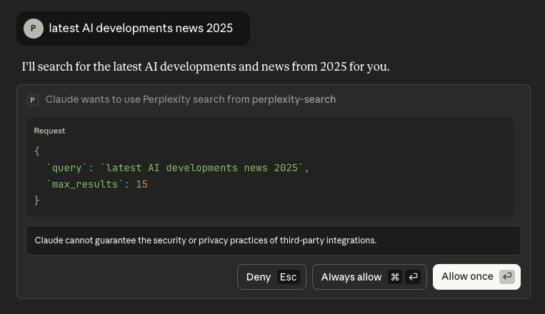

# Perplexity Search MCP Server

An MCP server implementation that integrates the Perplexity Search API to provide Claude with real-time web search capabilities.

> **Note:** This project was forked from [perplexityai/modelcontextprotocol](https://github.com/perplexityai/modelcontextprotocol) and has been modified to use only the Perplexity Search API.

## Quick Start Demo

Once configured, Claude can perform real-time web searches directly within your conversations:

```
You: "What are the latest AI developments in 2025?"
Claude: [Uses perplexity_search tool]
Claude: "Based on recent search results, here are the latest developments..."
```

### Visual Guide

**1. Enable the Tool**

Click the Research button and ensure "perplexity-search" is toggled on:


**2. Grant Permission**

When Claude wants to search, you'll see a permission dialog showing the query:



**3. Get Results**

Claude receives real-time search results with citations:


## Overview

This MCP (Model Context Protocol) server provides a tool for performing web searches using Perplexity's Search API. It leverages Perplexity's real-time web search technology to return ranked search results with titles, URLs, snippets, publication dates, and last updated timestamps.

The Search API powers products with unparalleled real-time, web-wide research capabilities, making it ideal for applications that need current information and comprehensive web coverage.

## Why This MCP Server?

**Give Claude Real-Time Knowledge**: Claude's training data has a cutoff date, but with this MCP server, Claude gains access to current information from across the web through Perplexity's Search API.

**Key Benefits:**
- 🎯 **Accurate & Current**: Get real-time information instead of relying on potentially outdated training data
- 🔗 **Source Citations**: Every result includes URLs and publication dates for verification
- 🌐 **Comprehensive Coverage**: Search across the entire web, not just a limited knowledge base
- ⚡ **Fast & Efficient**: Optimized search with configurable result limits and token extraction
- 🛠️ **Developer-Friendly**: Simple setup with TypeScript support and clear documentation

**Perfect For:**
- Research and fact-checking current events
- Finding recent documentation and technical resources
- Discovering trending topics and emerging technologies
- Answering questions that require up-to-date information
- Building AI applications that need web search capabilities

## Tech Stack

- **TypeScript**: Type-safe server implementation
- **Model Context Protocol (MCP) SDK**: Official SDK for building MCP servers
- **Perplexity Search API**: Real-time web search with advanced filtering
- **Node.js**: Runtime environment (v18+)
- **pnpm**: Fast, disk-efficient package manager

## Features

- 🔍 **Real-time Web Search**: Access up-to-date information from across the web using Perplexity's Search API
- 📊 **Structured Results**: Returns formatted search results with titles, URLs, snippets, and timestamps
- 🌍 **Regional Filtering**: Support for country-specific search results using ISO 3166-1 alpha-2 codes
- 🔢 **Flexible Result Limits**: Configure result counts (1-20 results per query)
- 🎯 **Multi-Query Support**: Process up to 5 search queries in a single request
- ⚡ **Batch Operations**: Efficient parallel processing for multiple searches
- 🔒 **Type-Safe Implementation**: Full TypeScript support for reliability and developer experience

## Tools

### perplexity_search

Performs web search using the Perplexity Search API and returns ranked search results.

**Inputs:**
- `query` (string | string[]): Search query string or array of query strings (max 5 queries)
- `max_results` (number, optional): Maximum number of results to return (1-20, default: 10)
- `max_tokens_per_page` (number, optional): Maximum tokens to extract per webpage (default: 1024)
- `country` (string, optional): ISO 3166-1 alpha-2 country code for regional results (e.g., 'US', 'GB')

**Output:**
Formatted search results including:
- Title
- URL
- Snippet
- Publication date
- Last updated timestamp

## Installation

### Prerequisites

- Node.js >= 18
- pnpm
- Perplexity API key

### Step 1: Clone and Install

```bash
git clone https://github.com/agenisea/perplexity-search-mcp.git
cd perplexity-search-mcp/perplexity-search
pnpm install
```

### Step 2: Get a Perplexity API Key

1. Sign up for a [Perplexity API account](https://www.perplexity.ai/settings/api)
2. Generate your API key from the developer dashboard
3. Create a `.env.local` file in the `perplexity-search` directory:

```bash
cp .env.local.example .env.local
```

4. Add your API key to `.env.local`:

```
PERPLEXITY_API_KEY=your_api_key_here
```

#### API Pricing & Rate Limits

The Perplexity Search API operates on a pay-as-you-go model:

- **Pricing**: Based on API requests and token usage (check [Perplexity Pricing](https://www.perplexity.ai/settings/api) for current rates)
- **Free Tier**: New accounts may receive initial credits for testing
- **Rate Limits**: Varies by subscription tier (see your dashboard for specific limits)
- **Credits**: Monitor your usage and credits in the [Perplexity API Settings](https://www.perplexity.ai/settings/api)

> **Tip**: Use the `max_results` and `max_tokens_per_page` parameters to control costs and optimize performance based on your needs.

### Step 3: Build the Project

```bash
pnpm run build
```

## Usage

### Local Development

Run the server locally with environment variables loaded:

```bash
pnpm run dev
```

### Production

Run without dotenv (requires environment variables set externally):

```bash
pnpm run start
```

Or with explicit environment variable:

```bash
PERPLEXITY_API_KEY=your_api_key node dist/index.js
```

### Testing

Test the search functionality with the included test script:

```bash
node test-search.js
```

## Claude Desktop Configuration

### Using Node.js directly

Add this to your `claude_desktop_config.json`:

```json
{
  "mcpServers": {
    "perplexity-search": {
      "command": "node",
      "args": [
        "/absolute/path/to/perplexity-search-mcp/perplexity-search/dist/index.js"
      ],
      "env": {
        "PERPLEXITY_API_KEY": "YOUR_API_KEY_HERE"
      }
    }
  }
}
```

### Using Docker

Build and run with Docker:

```bash
# Build the Docker image
docker build -t perplexity-search-mcp perplexity-search/

# Run the container
docker run -i --rm -e PERPLEXITY_API_KEY=your_api_key_here perplexity-search-mcp
```

Access the config file:

```bash
# macOS
vim ~/Library/Application\ Support/Claude/claude_desktop_config.json

# Windows
notepad %APPDATA%\Claude\claude_desktop_config.json
```

## Verifying the Integration

1. Open Claude Desktop
2. Look for the hammer icon (🔨) in the interface
3. Click it to see available MCP tools
4. You should see `perplexity_search` listed

If the tool appears, the integration is active and Claude can now perform web searches via Perplexity!

## Advanced Configuration

You can customize search parameters directly in your tool calls:

```javascript
{
  "query": "artificial intelligence",
  "max_results": 5,
  "max_tokens_per_page": 2048,
  "country": "US"
}
```

For multi-query searches:

```javascript
{
  "query": ["AI trends 2024", "machine learning applications", "neural networks"],
  "max_results": 10
}
```

Refer to the official [Perplexity Search API documentation](https://docs.perplexity.ai/api-reference/search-post) for more details.

## About the Perplexity Search API

The [Perplexity Search API](https://www.perplexity.ai/hub/blog/introducing-the-perplexity-search-api) provides real-time web search capabilities with advanced filtering options, enabling developers to integrate powerful search functionality into their applications.

### Key Capabilities

**Real-Time Web Search**
- Access current information from across the entire web
- Results include titles, URLs, snippets, and publication timestamps
- Automatically ranked by relevance and authority

**Advanced Filtering Options**
- **Domain Filtering**: Search within specific domains (e.g., `arxiv.org`, `github.com`)
- **Recency Filters**: Limit results by time period (day, week, month, year)
- **Geographic Filtering**: Country-specific results using ISO country codes
- **Result Limits**: Configure number of results (1-20) per query

**Web-Grounded Responses**
- Every result backed by real web sources with URLs
- Publication dates and last updated timestamps for verification
- Snippet extraction with configurable token limits

**Batch Processing**
- Process up to 5 queries simultaneously
- Efficient parallel search execution
- Consistent result formatting across all queries

### Search API vs Chat API

**When to use the Search API** (this MCP server):
- You need structured search results with URLs and metadata
- You want control over result count and filtering
- You're building search-focused features
- You need raw search data for further processing

**When to use the Chat API**:
- You need conversational responses with citations
- You want AI-generated summaries of search results
- You're building chatbot or Q&A features
- You need the "sonar" or "sonar-pro" models

This MCP server uses the **Search API** to provide Claude with direct access to structured search results, enabling Claude to reason over raw web data and provide more nuanced responses.

### Performance Characteristics

- **Latency**: Typically <2 seconds for standard queries
- **Freshness**: Real-time indexing of web content
- **Coverage**: Comprehensive web-wide search across billions of pages
- **Reliability**: Enterprise-grade infrastructure with high availability

Learn more at:
- [Perplexity Search API Overview](https://docs.perplexity.ai/getting-started/overview)
- [API Reference Documentation](https://docs.perplexity.ai/api-reference/search-post)
- [Introducing the Perplexity Search API](https://www.perplexity.ai/hub/blog/introducing-the-perplexity-search-api)

## Project Structure

```
perplexity-search-mcp/
├── perplexity-search/
│   ├── dist/              # Compiled JavaScript (gitignored)
│   ├── index.ts           # Main MCP server implementation
│   ├── test-search.js     # Test script for search functionality
│   ├── Dockerfile         # Docker container configuration
│   ├── package.json       # Node.js package configuration
│   ├── pnpm-lock.yaml     # pnpm lock file for reproducible builds
│   ├── tsconfig.json      # TypeScript configuration
│   ├── .env.local         # Local environment variables (gitignored)
│   └── .env.local.example # Environment template
├── .gitignore             # Git ignore rules
├── assets/                # Documentation images
├── README.md              # This file
└── LICENSE                # MIT License
```

## Development Scripts

```bash
# Build TypeScript to JavaScript
pnpm run build

# Run in development mode (loads .env.local)
pnpm run dev

# Run in production mode
pnpm run start

# Watch mode for development
pnpm run watch

# Test the search functionality
node test-search.js
```

## Troubleshooting

### API Key Not Found

```
Error: PERPLEXITY_API_KEY environment variable is required
```

**Solution:** Ensure your `.env.local` file exists and contains your API key, or set it as an environment variable.

### Connection Issues

- Verify your API key is valid at [Perplexity API Settings](https://www.perplexity.ai/settings/api)
- Check your internet connection
- Ensure you have API credits available

### MCP Server Not Showing in Claude

1. Restart Claude Desktop completely
2. Verify the path in `claude_desktop_config.json` is correct
3. Check Claude's developer console for errors
4. Ensure the server builds without errors (`pnpm run build`)

For additional troubleshooting, refer to the [MCP Debugging Guide](https://modelcontextprotocol.io/docs/tools/debugging).

## Security Best Practices

### API Key Management

**Never commit your API key to version control:**

```bash
# ✅ Good - .env.local is in .gitignore
PERPLEXITY_API_KEY=pplx-xxxxxxxxxxxxx

# ❌ Bad - Never commit keys directly in code
const apiKey = "pplx-xxxxxxxxxxxxx"
```

**Environment Variables:**
- Use `.env.local` for local development (automatically gitignored)
- Set environment variables directly in production environments
- Use secrets management services (AWS Secrets Manager, HashiCorp Vault, etc.) for production deployments

**Key Rotation:**
- Rotate API keys periodically
- Immediately revoke and regenerate keys if compromised
- Use separate keys for development, staging, and production environments

### Claude Desktop Configuration Security

When adding the API key to `claude_desktop_config.json`:

```json
{
  "mcpServers": {
    "perplexity-search": {
      "env": {
        "PERPLEXITY_API_KEY": "your_api_key_here"
      }
    }
  }
}
```

**Security Notes:**
- This file is stored locally on your machine
- Ensure proper file permissions (read-only for your user)
- Be cautious when sharing screenshots or debugging output
- Consider using environment variable references if your system supports it

### Production Deployment

For production environments:
- Use environment variables instead of config files
- Implement request rate limiting
- Monitor API usage for anomalies
- Set up alerts for unusual activity or quota thresholds

## Cursor Integration

You can use this MCP server with Cursor or any other application that supports the Model Context Protocol.

1. Navigate to Cursor Settings
2. Go to the MCP directory
3. Click "Add new global MCP server"
4. Insert the same configuration as used for Claude Desktop

## Contributing

Contributions are welcome! Please feel free to submit issues or pull requests.

## License

This MCP server is licensed under the MIT License. You are free to use, modify, and distribute the software, subject to the terms and conditions of the MIT License. For more details, please see the LICENSE file in the project repository.

## Credits

- Forked from [perplexityai/modelcontextprotocol](https://github.com/perplexityai/modelcontextprotocol)
- Powered by [Perplexity Search API](https://docs.perplexity.ai/api-reference/search-post)
- Built with [Model Context Protocol SDK](https://github.com/modelcontextprotocol/sdk)
